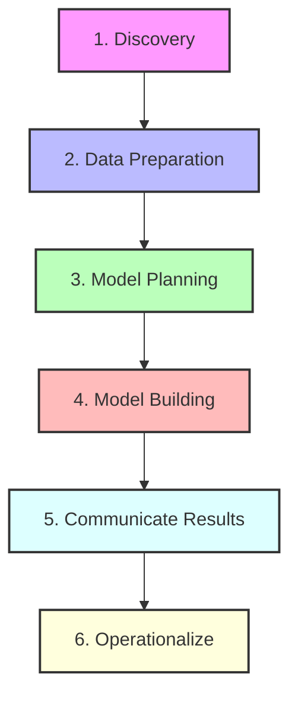

# The Data Analytics Lifecycle (DALC) Implementation Guide

This document outlines how the **Ecommerce Analytics Platform** maps directly to the 6 phases of the **Data Analytics Lifecycle (DALC)**.

---

## 🗺️ DALC Phases & Technical Mapping

### Phase 1: Discovery
- **Business Challenge**: Online ecommerce retailers struggle with customer retention (churn) and need to understand the true lifetime value (CLV) of customers in order to optimize acquisition spends and categories.
- **Hypothesis**: Demographic features (age, country, acquisition channel) combined with early clickstream behavioral markers (views, cart additions, session counts) can predict whether a customer will return to buy, and forecast their aggregate spend.
- **Repository Location**: Evaluated and tracked in the introductory configurations and analytical goal definitions.

### Phase 2: Data Preparation
- **Approach**: Synthesized realistic user behavior containing structured statistical correlations (e.g. older users from specific channels spending more, users with high cart additions but zero purchases having higher churn rates).
- **Execution**: Coded inside `ml/data_generator.py` and exported to clean CSV files:
  - `raw_customers.csv`
  - `raw_products.csv`
  - `raw_orders.csv`
  - `raw_order_items.csv`
  - `raw_web_events.csv`

### Phase 3: Model Planning
- **Approach**: Cleaned raw strings, parsed timestamps, mapped transaction structures, and calculated RFM metrics.
- **Tooling**: Orchestrated using **dbt** with a local **DuckDB** adapter.
- **Execution**: Staging views filter raw data, and mart tables aggregate characteristics per customer:
  - `dim_customers.sql`: Compiles `recency_days`, `total_orders`, `total_spend`, `total_sessions`, `total_cart_additions`, and creates the target label `is_churned`.
  - `fct_orders.sql`: Unifies line-level items with categories to track product category performance.

### Phase 4: Model Building
- **Approach**: Trained supervised machine learning algorithms. We split the analytics dataset 80/20 into training and validation folds.
  - **Churn Classifier**: XGBClassifier predicting `is_churned` (1 or 0). 
    - *Anti-Leakage Guard*: Excluded `recency` features since recency determines the churn label definition.
  - **CLV Regressor**: XGBRegressor predicting `total_spend` based on demographics and session behavior.
- **Execution**: Implemented in `ml/train.py` which serializes model structures to `churn_model.json` and `clv_model.json`.

### Phase 5: Communicate Results
- **Approach**: Visualization of metric KPIs, charts, and customer risk profiles.
- **Tooling**: Built inside a client-side **Next.js** React SPA using **Tailwind CSS** and **Recharts**.
- **Execution**: Renders sales over time, conversion funnels, catalog sales, and lists customer predictive cards.

### Phase 6: Operationalize
- **Approach**: Serving models in production.
- **Tooling**: Exposed via a high-performance **FastAPI** web service inside `api/main.py`.
- **Execution**: Exposes POST routes (`/api/predict/churn`, `/api/predict/clv`) allowing client frontends to simulate user interactions and calculate real-time predictions.
